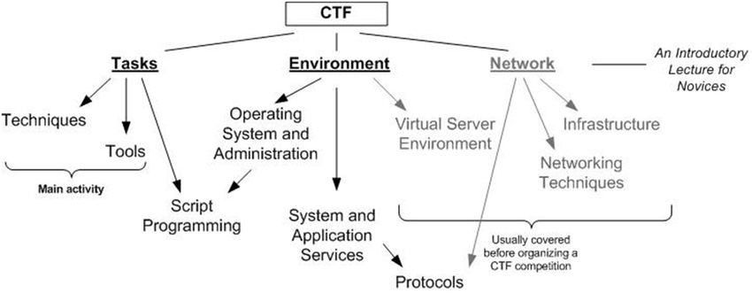

# CyberSec - Roadmap

#### Starting && participating in random CTFs online and offline  (my own journey)
  -> First one was during the integration week of my school (1337) : {date???}   
  -> Second one: 8 March HTB UM6P-1337 CTF.  

### [What is a CTF?](https://ctftime.org/ctf-wtf/)
Capture the flag or a CTF is simply a competition where you do some sort of tasks  where you usually have to look for a flag that looks like : `HTB={this-is-the-flag}`, once you get that flag you simply have to submit it to the CTF platform, but what's important is what you learn during that journey while looking for the flag either on some sort of code or while diving into a machine or even attacking the other teams' server.. and that depends on the style of the CTF.

### CTFs Styles
**Jeopardy-Style CTF:** Teams solve individual challenges from various categories to earn points. No interaction between teams. A Jeopardy CTF usually includes the following domains:

1. **Cryptography**: Breaking or solving ciphers and encryption schemes.
2. **Forensics**: Analyzing digital artifacts like files, memory dumps, or network traffic.
3. **Web Security**: Exploiting vulnerabilities in web applications (e.g., SQL injection, XSS).
4. **Reverse Engineering**: Analyzing compiled programs to understand their behavior or extract flags.
5. **Pwn**: Exploiting vulnerabilities in binary executables or system processes.
6. **Steganography**: Finding hidden messages in images, audio, or other media.
7. **Miscellaneous**: Logic puzzles, math challenges, or any other non-technical tasks.
8. **Osint**:  challenges in CTFs involve gathering information from publicly available sources like websites and social media, testing skills in data extraction and analysis... (my fav one).

**Attack-Defense CTF:** Teams defend their own servers while attacking others to steal flags and earn points.

**Mixed CTF:** Combines Jeopardy-style challenges with attack-defense elements, requiring teams to solve challenges and protect/attack servers.

### Useful Platforms
  -> [HTB (HackTheBox)](https://www.hackthebox.com/)  
  -> [TryHackMe](https://tryhackme.com/)  
  -> [learnCTF](https://ctflearn.com/)   
  -> [OverTheWire](https://overthewire.org/wargames/)   
  -> [rootme](https://www.root-me.org/)  
  -> [HackThisSite](https://www.hackthissite.org/)  
  -> [Ringzer0team](http://ringzer0ctf.com/)  
  -> [Pwnable.kr](https://pwnable.kr/)  
  -> [w3challs](https://w3challs.com/)  
  -> [learn2hack](learn2hack.io)  
  -> [netacad cybsec introduction course](https://www.netacad.com/courses/introduction-to-cybersecurity?courseLang=en-US)  
  -> [linuxjourney](https://linuxjourney.com/)  
  -> [hacker101](https://www.hacker101.com/)  
  -> [picoctf](https://picoctf.org/)  
  -> [hacksplaining](https://www.hacksplaining.com/lessons)  
  -> [ohmygit](https://ohmygit.org/)  
  -> [Exercism](https://exercism.org/)  
  -> [adventofcode](https://adventofcode.com/)  
  -> [TheLinuxFoundation](https://training.linuxfoundation.org/)   
  -> [Hackmyvm](https://hackmyvm.eu/)   
  -> *also discord servers are very very veeeeery important!*   
  -> ...  *(this is being updated from time to time)*

### Online Courses to take +  digital badges/certificates

+ [C for Everyone: Programming Fundamentals
](https://www.coursera.org/learn/c-for-everyone)  
+ [Programming Languages, Part C
](https://www.coursera.org/learn/programming-languages-part-c)   
+ [Hands-on Introduction to Linux Commands and Shell Scripting
](https://www.coursera.org/learn/hands-on-introduction-to-linux-commands-and-shell-scripting)  
+ [TheLinuxFoundation](https://training.linuxfoundation.org/) learning path.. 
+ ... (this is being updated from time to time)

### More... (blogs, articles && repositories...)
+ https://blog.g0tmi1k.com/  
+ https://www.isss.io/resources.html  
+ https://github.com/utisss/  
+ [ISSS official YT channel](https://www.youtube.com/@informationsystemssecurity1034/videos)   
+ [ISSS official website](https://www.isss.io/)   
+ [ISSS official github acc](https://github.com/utisss)   
+ ... *(this is being updated from time to time)*

### Useful Tools

+ **kali Linux tools**: [This website](ttps://www.kali.org/tools/  ) includes all the tools that usually comes with the distro.

+ **nmap**: (Network Mapper)  

Nmap is a free and open-source utility for network discovery and security auditing. It is used to discover hosts and services on a computer network by sending packets and analyzing the responses.

+ **ftp**: (File Transfer Protocol)  
  
FTP is a standard network protocol used to transfer files from one host to another over a TCP-based network, such as the Internet. FTP is built on a client-server model architecture and uses separate control and data connections between the client and the server.

+ **Wireshark**: (Network Protocol Analyzer)  

Wireshark is a widely-used network protocol analyzer that captures and analyzes network packets in real time. It helps in troubleshooting network issues, inspecting data traffic, and diagnosing security problems.

+ **Metasploit**: (Penetration Testing Framework)  

Metasploit is a powerful penetration testing framework that helps security professionals identify and exploit vulnerabilities in a system. It includes a variety of exploits, payloads, and auxiliary tools for testing security.

+ **curl**: (Data Transfer Tool)  

Curl is a command-line tool used for transferring data using various he websitm the terminal.

+ **ssh**: (Secure Shell)  

SSH is a cryptographic network protocol used to securely access remote systems over an insecure network. It enables secure communication, file transfers, and remote command execution.

+ **Burp Suite**: (Web Vulnerabilhe websitilities in web apps, including an intercepting proxy, a web crawler, and a vulnerability scanner.he websit

### (Bonus) Nerdy things to check out ;)
+ https://www.texasacm.org/AtoZ
+ ... *(this is being updated from time to time)*
